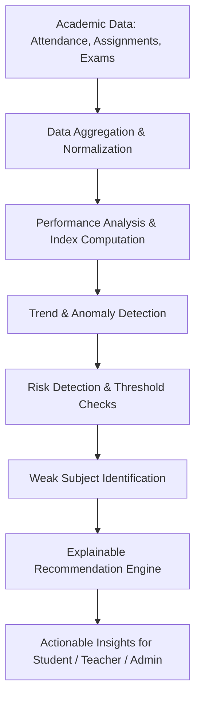
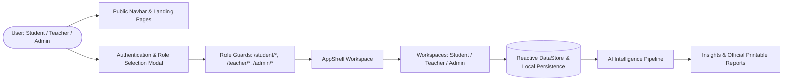

# EduIQ

> **An intelligent academic workspace that turns educational data into actionable insights.**

---

## What is EduIQ?

Traditional education management platforms store critical student data — attendance, assignments, examinations, and grades — inside fragmented silos. While schools generate vast amounts of data every day, traditional software treats these numbers as static records rather than connected signals.

**EduIQ bridges this gap.** It connects daily learning activity into one continuous academic pulse and transforms raw numbers into:

$$\text{DATA} \longrightarrow \text{SIGNAL} \longrightarrow \text{EXPLANATION} \longrightarrow \text{ACTION}$$

By synthesizing attendance health, assignment coursework scores, exam trajectories, and departmental context, EduIQ gives students, teachers, and administrators clear, explainable insights to improve learning outcomes before finals arrive.

---

## Key Features

### 🎓 For Students
- **Learning Portfolio**: Track enrolled courses, credit loads, and instructor details.
- **Assignment Center**: View deadlines, submit coursework, and receive status updates.
- **Attendance Monitor**: Live attendance ring with 75% threshold warning alerts.
- **Interactive Examinations**: Dedicated full-screen MCQ exam environment with real-time timers and instant grade breakdown.
- **My Progress & AI Recommendations**: Weak subject identification, score trend graphs, and step-by-step study tips.

### 👩‍🏫 For Teachers
- **Educator Workspace**: Collapsible sidebar, global command palette (`⌘K`), and contextual AI Copilot.
- **Classroom Attendance Portal**: Fast section-level `Present` / `Late` / `Absent` logging and `[Mark All Present]` CTA.
- **Submissions & AI Grading**: Split-view grading interface with document previews, rubric scoring, and an **AI Grading Assistant** (`[Accept AI Score]`).
- **Exam Builder**: Create and manage custom MCQ assessments with automatic grading rules.
- **Academic Pulse & Roster Intelligence**: Track classroom risk signals, at-risk student lists, and section trajectories.

### 🏛️ For Administrators
- **Institutional Governance**: Full CRUD oversight across Students, Teachers, Courses, and Class Sections.
- **Analytics & Anomaly Detection**: Institutional attendance metrics, grade trajectory distributions, and departmental performance comparisons.
- **Official Reports & Transcripts**: Generate and print official academic transcripts and evaluation summaries with browser print support.
- **Activity & System Monitoring**: Real-time activity logs tracking every administrative mutation.

---

## AI Academic Intelligence

EduIQ is **not a generic AI chatbot wrapper**. It implements a transparent, explainable academic data pipeline that calculates actionable signals from real student data:



### Real-World Example
1. **Raw Input**:
   - Attendance: `68%` (Below 75% threshold)
   - Calculus & Linear Algebra Scores: `64% → 61% → 58%` (Declining across 3 assessments)
2. **EduIQ Synthesis**:
   - *Risk Signal*: High academic drop risk in Mathematics.
   - *Explanation*: "Calculus scores have dropped 6% over 3 consecutive assessments while attendance remains below 75%."
3. **Targeted Action**:
   - *For Student*: "Review calculus integration fundamentals & schedule 2 focused study sessions."
   - *For Educator*: "Schedule early intervention check-in with Maya Whitfield."

---

## System Architecture



---

## Technology Stack

- **Core**: React 18, TypeScript, Vite
- **Styling**: Tailwind CSS, Vanilla CSS Glassmorphism
- **Animations**: Framer Motion
- **Icons & UI**: Custom SVG Icon Engine, Reusable Component Library
- **State Management**: Reactive DataStore (`useSyncExternalStore`), LocalStorage Persistence
- **Routing**: React Router v6 with Role-Based Route Protection (`RoleGuard.tsx`)

---

## Project Structure

```
c:/buildathon/
├── docs/                      # Comprehensive technical & product documentation
│   ├── ARCHITECTURE.md
│   ├── PRODUCT_OVERVIEW.md
│   ├── USER_GUIDE.md
│   ├── AI_INTELLIGENCE.md
│   ├── DATABASE.md
│   ├── API.md
│   ├── AUTHENTICATION.md
│   ├── ROUTING.md
│   ├── DEMO_MODE.md
│   ├── TESTING.md
│   ├── PROJECT_FLOW.md
│   └── FEATURE_MATRIX.md
├── src/
│   ├── components/            # Reusable UI, Layout, Workspace & Onboarding components
│   │   ├── academic/          # BarChart, LineChart, InsightCard
│   │   ├── auth/              # RoleSelectionModal
│   │   ├── layout/            # AppShell, PublicLayout
│   │   ├── onboarding/        # OnboardingModal, HelpModal
│   │   ├── ui/                # Button, Card, Badge, Modal, PageHeader, StatCard, Icon
│   │   └── workspace/         # CommandPaletteModal, ContextualAIDrawer
│   ├── data/                  # Mock institutional datasets & initial state
│   ├── hooks/                 # useAuth, useToast
│   ├── lib/                   # AI rules engine & local profile store
│   ├── pages/                 # Public, Student, Teacher, Admin & Shared pages
│   ├── services/              # dataStore, authService, studentService, teacherService, adminService
│   ├── types/                 # TypeScript interfaces and schemas
│   ├── App.tsx                # Central Router & Suspense Loader
│   └── main.tsx               # Application entry point
├── package.json
├── tsconfig.json
└── vite.config.ts
```

---

## Getting Started

### Prerequisites
- Node.js (v18+ recommended)
- npm or yarn

### Installation & Local Development
```bash
# 1. Clone the repository
git clone https://github.com/eduiq/eduiq.git
cd eduiq

# 2. Install dependencies
npm install

# 3. Start the local development server
npm run dev

# 4. Build for production preview
npm run build
npm run preview
```

---

## Demo Mode Credentials

EduIQ features a **Zero-Error Local Demo Mode**. Users can authenticate seamlessly using demo credentials or Google/Microsoft social OAuth simulation:

| Role | Demo Email | Password | Access / Redirect |
| :--- | :--- | :--- | :--- |
| **Student** | `maya@eduiq.edu` | *Any password / OAuth* | `/student/dashboard` |
| **Teacher** | `elena@eduiq.edu` | *Any password / OAuth* | `/teacher/dashboard` |
| **Administrator** | `admin@eduiq.edu` | *Any password / OAuth* | `/admin/dashboard` |

---

## Main User Routes

| Role | Route | Purpose |
| :--- | :--- | :--- |
| **Public** | `/` | Hero, feature previews, CTAs |
| **Public** | `/courses` | Searchable course catalog |
| **Public** | `/courses/:courseId` | Detailed course info & enrollment |
| **Public** | `/contact` | Help, FAQ accordion & validated contact form |
| **Public** | `/login`, `/register` | Authentication & role selector modal |
| **Student** | `/student/dashboard` | Personal performance summary & attendance ring |
| **Student** | `/student/courses` | Enrolled coursework & learning portfolio |
| **Student** | `/student/assignments` | Assignment deadlines & submission workspace |
| **Student** | `/student/attendance` | Attendance log & threshold status |
| **Student** | `/student/examinations` | Online assessment catalog & result reviews |
| **Student** | `/student/examinations/:id` | Full-screen timed examination mode |
| **Student** | `/student/progress` | Weak subject breakdown & AI recommendations |
| **Teacher** | `/teacher/dashboard` | Educator control center & schedule timeline |
| **Teacher** | `/teacher/attendance` | Rapid section attendance marker (`Present`/`Late`/`Absent`) |
| **Teacher** | `/teacher/submissions` | Split-view grading workspace with AI Grading Assistant |
| **Teacher** | `/teacher/examinations` | MCQ Exam Builder & assessment status |
| **Teacher** | `/teacher/insights` | Academic Pulse node diagram & class risk alerts |
| **Admin** | `/admin/dashboard` | Institutional executive dashboard |
| **Admin** | `/admin/students` | Student roster governance (Add/Edit/Delete) |
| **Admin** | `/admin/teachers` | Faculty management & department assignments |
| **Admin** | `/admin/reports` | Printable official institutional transcripts & summaries |

---

## License & Attribution

© 2026 EduIQ Academic Intelligence Platform. Built for educational excellence.
