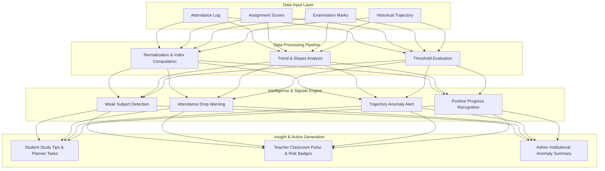

# AI Academic Intelligence Architecture

## 1. System Purpose & Principles
The EduIQ AI Academic Intelligence Engine is designed to solve a core problem in modern educational technology: traditional education management software exposes attendance, assignments, and examination scores as isolated, static numbers. EduIQ connects these disconnected signals into one continuous academic pulse and translates raw data into explainable explanations and targeted recommendations.

> **Implementation & Transparency Disclosure**: EduIQ currently utilizes an **explainable, deterministic rules-based intelligence pipeline** (`src/lib/ai/rules.ts`) combined with contextual educator and student AI drawers. It does not rely on opaque deep learning models or uncalibrated LLM predictions, ensuring that every insight is 100% data-grounded, reproducible, and verifiable.

---

## 2. Intelligence Architecture Diagram

---

## 3. Data Sources & Mathematical Index Formulations

### 1. Attendance Rate ($A$)
Calculated from session attendance entries ($Present = 1.0, Late = 0.5, Absent = 0.0$):
$$A = \left( \frac{\sum \text{Present} + 0.5 \times \sum \text{Late}}{N_{\text{sessions}}} \right) \times 100$$

### 2. Composite Academic Score ($S_{\text{academic}}$)
Calculated as the mean of assignment averages ($S_{\text{assig}}$) and examination averages ($S_{\text{exam}}$) across enrolled subjects:
$$S_{\text{academic}} = \frac{1}{M} \sum_{i=1}^{M} \left( \frac{S_{\text{assig}, i} + S_{\text{exam}, i}}{2} \right)$$

### 3. Overall Composite Performance Index ($P$)
$$P = \left( 0.6 \times S_{\text{academic}} \right) + \left( 0.4 \times A \right)$$

---

## 4. Signal Detection & Rule Specifications

| Signal Rule | Target Condition | Severity | Synthesized Output & Rationale |
| :--- | :--- | :--- | :--- |
| **Weak Subject Alert** | Subject average $< 65\%$ OR subject score $< (\text{Subject}_{\text{mean}} - 15\%)$ | `high` | Identifies subject name, gap to average, and recommends fundamental review. |
| **Attendance Drop Warning** | Attendance rate $A < 75\%$ | `high` / `moderate` | Flags missed sessions and calculates required attended lectures to restore standing. |
| **Declining Trajectory** | Exam history shows 3 consecutive drops ($e_{n-2} > e_{n-1} > e_n$) | `high` | Warns of declining trajectory and advises teacher intervention before finals. |
| **Positive Progress** | Recent exam score $> \text{Previous score}$ ($e_n > e_{n-1}$) | `positive` | Recognizes academic growth and suggests advancing to enrichment coursework. |

---

## 5. End-to-End Concrete Example

1. **Input Signal**:
   - Attendance: `68%` (Below 75% target)
   - Calculus & Linear Algebra: `62% → 58% → 54%` (Declining across 3 tests)
2. **Analysis Output**:
   - `category: 'weak_subject'`, `severity: 'high'`, `subject: 'Mathematics'`.
3. **Generated Explanation**:
   - *"Mathematics performance is declining (down 8% over 3 assessments) while attendance remains at 68%."*
4. **Generated Action Plan**:
   - **For Student**: Schedule 2 focused calculus study sessions in the Study Planner.
   - **For Educator**: Open Submissions and review problem set mistakes with Maya Whitfield.
   - **For Administrator**: Track Mathematics section cohort health in institutional reports.
