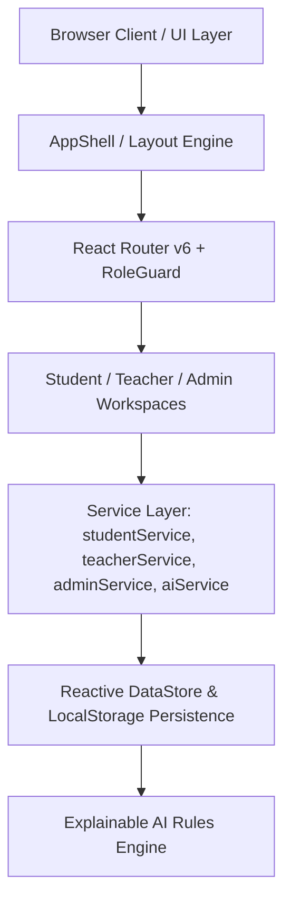
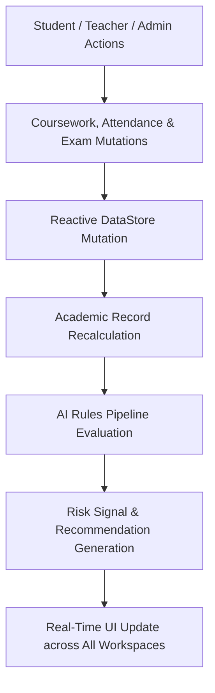

# System Architecture Documentation

## 1. System Overview
EduIQ is built as a single-page client-side web application leveraging React 18, TypeScript, and Vite. State management and real-time reactive updates are handled via a centralized reactive data store (`dataStore.ts`) utilizing `useSyncExternalStore`.

---

## 2. Application Layers

### Layer 1: Presentation & Layout
- **AppShell (`src/components/layout/AppShell.tsx`)**: Responsive, collapsible layout shell providing role-adapted sidebars, topbar notification counters, command palette modal (`⌘K`), contextual AI drawers, and onboarding triggers.
- **UI Components (`src/components/ui/`)**: Pure design system tokens (Card, Button, Badge, Modal, StatCard, PageHeader, Icon).

### Layer 2: Business Logic & Services
- **Student Service (`src/services/studentService.ts`)**: Handles course enrollment queries, assignment submission payloads, and exam score computations.
- **Teacher Service (`src/services/teacherService.ts`)**: Manages classroom section roster queries, attendance batch saves, and submission grading.
- **Admin Service (`src/services/adminService.ts`)**: Manages faculty roster mutations, student record CRUD, and institutional analytics.
- **AI Service (`src/services/aiService.ts`)**: Runs performance analysis algorithms over attendance logs and coursework score arrays.

### Layer 3: Reactive State & Data Store
- **DataStore (`src/services/dataStore.ts`)**: Central reactive hub managing courses, classes, enrollments, assignments, exams, student records, roster, attendance logs, and administrative activity logs. Subscriptions update across all mounted views reactively without page reloads.

---

## 3. Authentication & Security Architecture
- **Dual-Mode Authentication**: Supports real cloud database auth when configured, with seamless fallback to Local Demo Mode when cloud credentials are missing.
- **Role Selection Engine**: Social OAuth (Google / Microsoft) prompts the unified `RoleSelectionModal` (*"How will you use EduIQ?"*) before session initialization.
- **Route Guard Protection (`RoleGuard.tsx`)**: Inspects `user.role` on route transitions. Unauthorized route attempts trigger immediate redirection to the user's home dashboard.

---

## 4. Academic Data Flow

---

## 5. Deployment & Runtime Environment
- **Build Tooling**: Vite 5.4 with TypeScript strict compilation (`tsc -b`).
- **Asset Bundling**: Minified production chunks with CSS extraction.
- **Environment Handling**: Graceful fallback ensures demo stability across static hosting providers (Vercel, Netlify, Cloudflare Pages).
