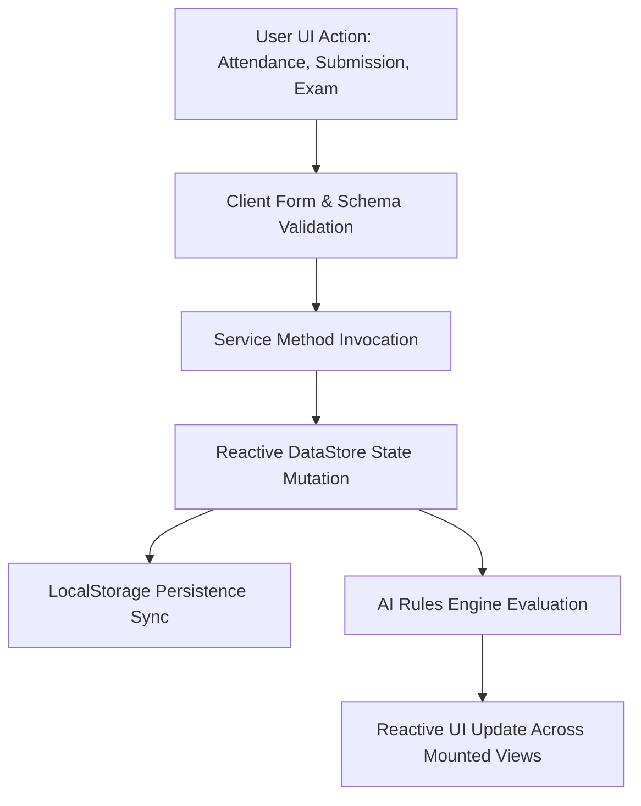

# End-to-End Data Flow Specification

## 1. Primary Data Pipeline Overview

---

## 2. Concrete Data Flow Scenarios

### Scenario A: Teacher Logs Classroom Attendance
1. **User Action**: Educator selects section `MATH-201-A` on `/teacher/attendance` and clicks `[Mark All Present]` or toggles `Present`/`Late`/`Absent`.
2. **UI Event**: `saveAttendance(records)` is invoked.
3. **Service Layer**: `teacherService.saveAttendance()` passes attendance records to `dataStore.ts`.
4. **DataStore Mutation**:
   - Updates student session log: `attendanceLog.push({ day, status })`.
   - Recalculates student attendance percentage: $A = \frac{\text{Present} + 0.5 \times \text{Late}}{N} \times 100$.
   - Adjusts roster student attendance percentage.
5. **AI Pipeline Processing**:
   - `aiService.getStudentInsights()` re-evaluates the student's new attendance rate against the $75\%$ threshold.
6. **Reactive UI Update**:
   - Student Dashboard updates the Attendance Ring SVG in real time.
   - Teacher Roster updates the Student Standing Badge (`✓ Good Standing` or `⚠ At Risk`).
   - Admin Analytics updates the Institutional Attendance Distribution Chart.

---

### Scenario B: Student Submits Coursework
1. **User Action**: Student opens `/student/assignments` and clicks `Submit` on `Problem Set 6`.
2. **UI Event**: `submitAssignment(assignmentId)` is triggered.
3. **Service Layer**: `studentService.submitAssignment()` updates assignment status in `dataStore.ts`.
4. **DataStore Mutation**:
   - Updates assignment status from `'pending'` to `'submitted'`.
   - Logs an administrative activity entry: `logActivity('ASSIGNMENT_SUBMIT', ...)`
5. **Reactive UI Update**:
   - Assignment status changes to `Needs Review` in Teacher Submissions (`/teacher/submissions`).
   - Student Dashboard assignment stat updates immediately.

---

### Scenario C: Teacher Grades Submission with AI Grading Assistant
1. **User Action**: Educator opens `/teacher/submissions`, inspects submission preview, and clicks `[Accept AI Score]`.
2. **UI Event**: `gradeAssignment(assignmentId, score, feedback)` is invoked.
3. **Service Layer**: `teacherService.gradeAssignment()` saves score and feedback.
4. **DataStore Mutation**:
   - Assignment status updates to `'graded'`, storing `score` and `feedback`.
   - Recalculates student subject `assignmentAvg`.
   - Recalculates student composite academic performance index.
5. **Reactive UI Update**:
   - Student receives score badge and instructor feedback under `/student/assignments`.
   - Student Progress page recalculates score trajectory lines.
